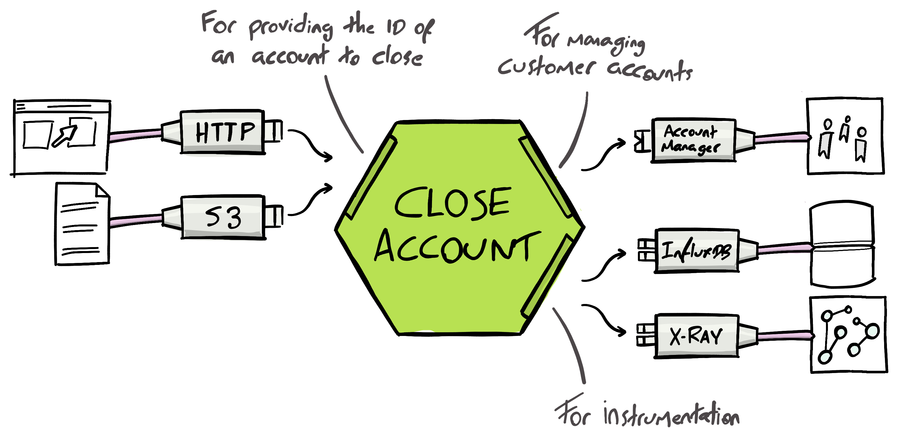

# AWS Lambda using Hexagonal Architecture

Demonstration repository to accompany my [blog article on applying hexagonal architecture](https://sketchingdev.co.uk/blog/lets-apply-hexagonal-architecture.html).

